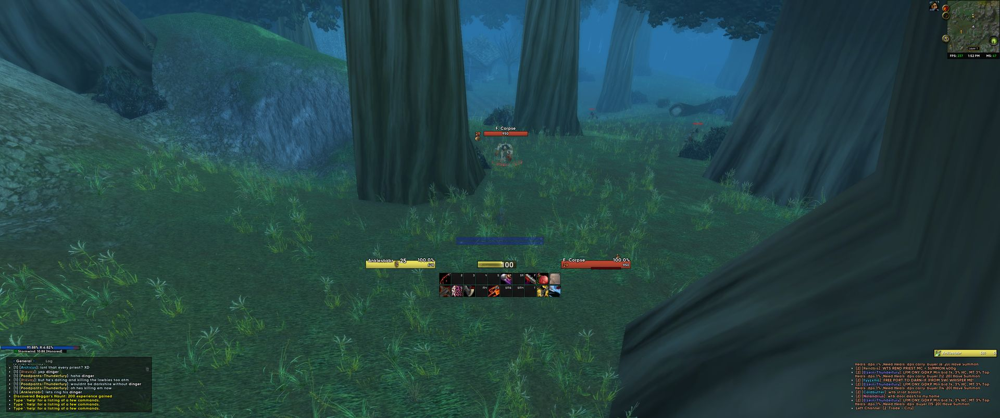
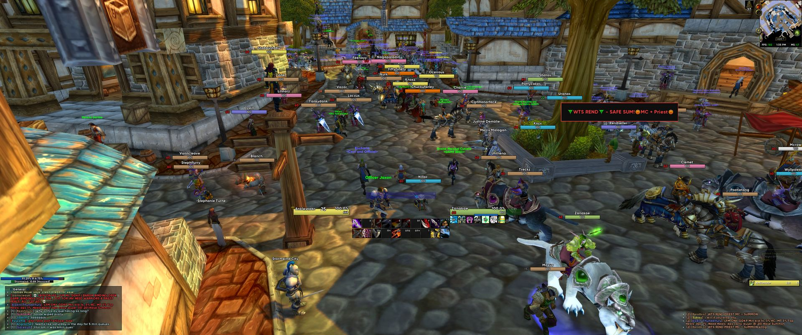
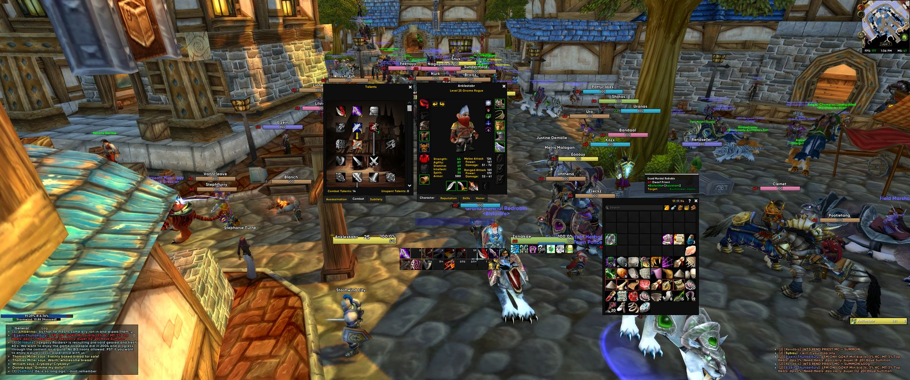
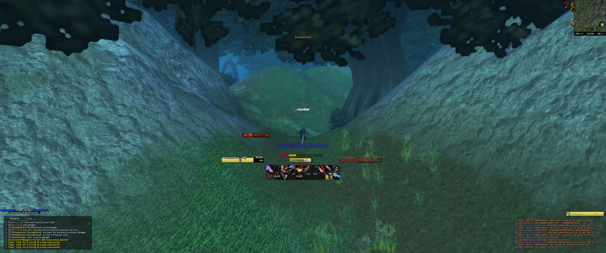
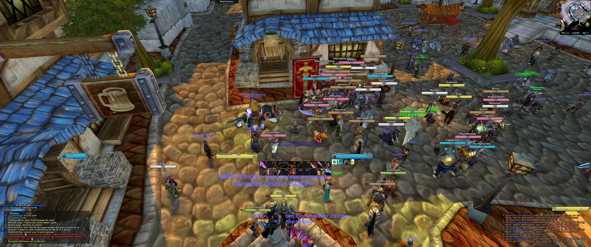

# RedtuzkUI Classic - Community Port

An ElvUI profile/layout skin for **World of Warcraft Classic Era / Anniversary Edition**.

Originally created by **Redtuzk** ([original GitLab repo](https://gitlab.com/RedtuzkUI/ElvUI_Redtuzk)). The original author stopped maintaining the project. This is a community port updated to work with current Classic Era (Interface 11508) and ElvUI v15+.

## Screenshots







## Requirements

- **ElvUI** (required) - download from [tukui.org](https://www.tukui.org/elvui)
- **Shadow & Light (ElvUI_SLE)** (optional, enhanced features)
- **AddOnSkins** (optional, addon styling)
- **Details! Damage Meter** (optional, profile included)
- **Plater Nameplates** (optional, profile included)
- **BigWigs** or **DBM** (optional, profiles included)

## Installation

1. **Install ElvUI first** if you haven't already ([tukui.org](https://www.tukui.org/elvui))
2. **Download** `ElvUI_RedtuzkClassic.zip` from the [latest release](https://github.com/dBlocc/ElvUI_RedtuzkClassic/releases/latest)
   - Use the `ElvUI_RedtuzkClassic.zip` file, NOT "Source code (zip)"
3. **Extract the zip** - it contains a folder called `ElvUI_RedtuzkClassic`
4. **Move that folder** into your WoW AddOns directory:
   ```
   World of Warcraft/_classic_era_/Interface/AddOns/
   ```
   So the final path looks like:
   ```
   World of Warcraft/_classic_era_/Interface/AddOns/ElvUI_RedtuzkClassic/Core.lua
   ```
5. **Launch WoW Classic** and the RedtuzkUI installer wizard will appear automatically
6. Follow the steps: create or select a profile, pick DPS/Tank layout, configure your options
7. Click **Finished** to apply and reload your UI

> **Important:** Download the zip from the Releases page, not the green "Code" button. The "Code" download adds a version suffix to the folder name which will prevent the addon from loading.

## Features

- DPS/Tank layout with in-game installer wizard
- Action bar presets: 5x2, 6x2, 8x2 configurations
- Party frame styles: Standard and M+
- Target frame aura options: Debuffs only, Buffs only, or Both
- Raid frame styles: Vertical or Traditional
- Custom datatexts: FPS and Ping displays with color-coded status and addon memory tracking
- Durability datatext with per-slot breakdown
- Profiles for Details, Plater, BigWigs, and DBM
- Custom fonts: Century Gothic Bold, Gilroy Bold, Rubik Medium

## What was changed from the original

The original Classic branch (Interface 11306, last updated August 2021) needed these fixes for current ElvUI:

- **WoW API**: Added `C_AddOns` compatibility shims for addon management functions
- **ElvUI API**: Updated deprecated calls for ElvUI v15+
- **Config key renames**: Updated renamed settings (raid frames, action bars, nameplates)
- **Missing table initializations**: Added guards for config paths removed in newer ElvUI
- **Dead code cleanup**: Removed references to removed ElvUI features
- **Bug fixes**: Fixed datatext bug, BigWigs profile name typo, various nil errors

## Credits

- **Redtuzk** - Original author and designer
- **Aldarana** - Co-maintainer of the original project
- **Toxicom (Toxi)** - Fixed the Retail version for The War Within
- **dBlocc** - Classic Era port

## Contributing

Found a bug or want to improve something? PRs are welcome. If you encounter Lua errors, open an issue with the full error message and stack trace.

## Also available on

- [CurseForge](https://www.curseforge.com/wow/addons/redtuzkui-classic)
- [Wago Addons](https://addons.wago.io/addons/QNlz9DKe)

## License

MIT License. Original design credit belongs to Redtuzk.
